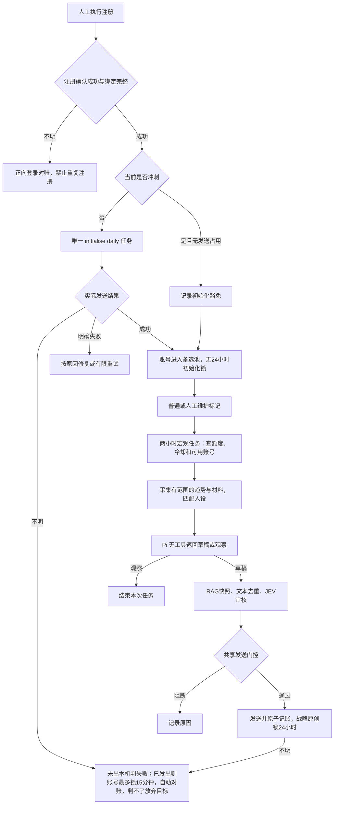
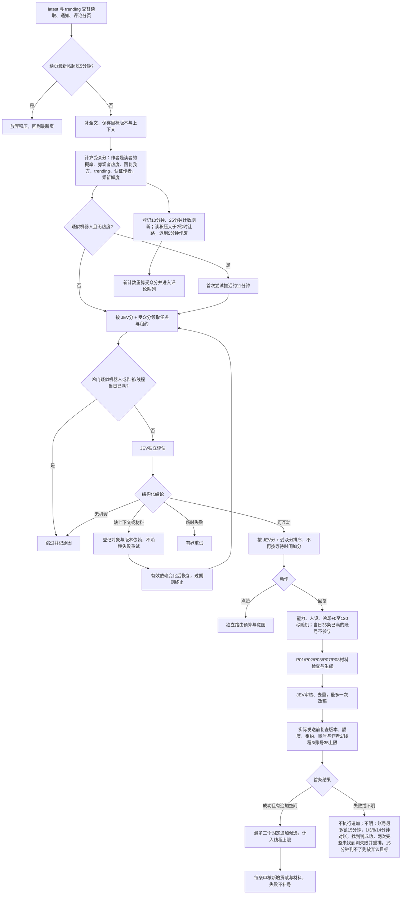
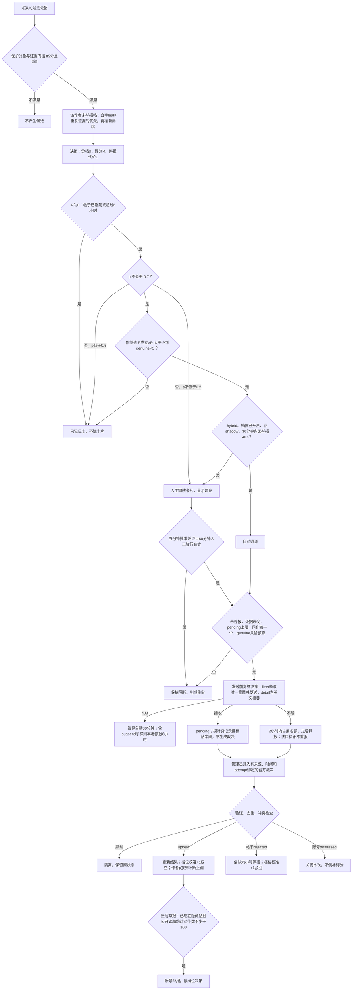

# v6 三棵执行逻辑树

本图描述本次实现。所有发送经过共享额度、SQLite意图、账号资格和实际发送前复查；模拟不记真实成功。官方裁决读取尚未接通，首版管理员录入。

## 原创

```mermaid
flowchart TD
 A[人工执行注册] --> B{注册确认成功与绑定完整}
 B -->|不明| C[正向登录对账，禁止重复注册]
 B -->|成功| D{当前是否冲刺}
 D -->|否| E[唯一 initialise daily 任务]
 E --> F{实际发送结果}
 F -->|成功| G[账号进入备选池，无24小时初始化锁]
 F -->|明确失败| H[按原因修复或有限重试]
 F -->|不明| I[未出本机判失败；已发出则账号最多锁15分钟，自动对账，判不了放弃目标]
 D -->|是且无发送占用| J[记录初始化豁免]
 J --> G
 G --> K[普通或人工维护标记]
 K --> L[两小时宏观任务：查额度、冷却和可用账号]
 L --> M[采集有范围的趋势与材料，匹配人设]
 M --> N[Pi 无工具返回草稿或观察]
 N -->|草稿| O[RAG快照、文本去重、JEV审核]
 N -->|观察| P[结束本次任务]
 O --> Q{共享发送门控}
 Q -->|通过| R[发送并原子记账，战略原创锁24小时]
 Q -->|阻断| S[记录原因]
 R -->|不明| I
```

## 回复（reply-targeting.v1）

```mermaid
flowchart TD
 A[latest 与 trending 交替读取、通知、评论分页] --> A1{续页最新帖超过5分钟?}
 A1 -->|是| A2[放弃积压，回到最新页]
 A1 -->|否| B[补全文，保存目标版本与上下文]
 B --> B1[计算受众分：作者是读者的概率、旁观者热度、回复我方、trending、认证作者，乘新鲜度]
 B1 --> B2{疑似机器人且无热度?}
 B2 -->|是| B3[首次尝试推迟约11分钟]
 B2 -->|否| C
 B3 --> C
 B1 --> R0[登记10分钟、25分钟计数刷新；读积压大于2秒时让路，迟到5分钟作废]
 R0 --> R1[新计数重算受众分并进入评论队列]
 C[按 JEV分 + 受众分领取任务与租约] --> C1{冷门疑似机器人或作者/线程当日已满?}
 C1 -->|是| I
 C1 -->|否| D[JEV独立评估]
 D --> E{结构化结论}
 E -->|缺上下文或材料| F[登记对象与版本依赖，不消耗失败重试]
 F --> G[有效依赖变化后恢复，过期则终止]
 G --> C
 E -->|临时失败| H[有界重试]
 E -->|无机会| I[跳过并记原因]
 E -->|可互动| J[按 JEV分 + 受众分排序，不再按等待时间加分]
 J --> K{动作}
 K -->|点赞| L[独立路由预算与意图]
 K -->|回复| M[能力、人设、冷却+0至120秒随机；当日35条已满的账号不参与]
 M --> N[P01/P02/P03/P07/P08材料检查与生成]
 N --> O[JEV审核、去重，最多一次改稿]
 O --> P[实际发送前复查版本、额度、租约、账号与作者2/线程3/账号35上限]
 P --> Q{首条结果}
 Q -->|成功且有追加空间| R[最多三个固定追加候选，计入线程上限]
 R --> S[每条审核新增贡献与材料，失败不补号]
 Q -->|失败或不明| T[不执行追加；不明：账号最多锁15分钟，1/3/8/14分钟对账，找到判成功，两次完整未找到判失败并重排，15分钟判不了则放弃该目标]
```

## 举报（report-decision.v2）

```mermaid
flowchart TD
 A[采集可追溯证据] --> B{保护对象与证据门槛 85分且2组}
 B -->|不满足| C[不产生候选]
 B -->|满足| D[该作者未举报帖：自带leak/重复证据的优先，再按新鲜度]
 D --> E[决策：分档p、得分R、停报代价C]
 E --> F{R为0：帖子已隐藏或超过6小时}
 F -->|是| SKIP[只记日志，不建卡片]
 F -->|否| G{p 不低于 0.7？}
 G -->|否，p不低于0.5| HUM[人工审核卡片，显示建议]
 G -->|否，p低于0.5| SKIP
 G -->|是| H{期望值 P成立×R 大于 P判genuine×C？}
 H -->|否| SKIP
 H -->|是| I{hybrid、档位已开启、非shadow、30分钟内无举报403？}
 I -->|否| HUM
 I -->|是| AUTO[自动通道]
 HUM --> J{五分钟批准凭证且60分钟人工放行有效}
 J -->|否| K[保持阻断，到期重审]
 J -->|是| L
 AUTO --> L{未停报、证据未变、pending上限、同作者一个、genuine风险预算}
 L -->|否| K
 L -->|是| M[发送前复算决策，fleet领取唯一意图并发送，detail为英文摘要]
 M -->|403| N403[暂停自动30分钟；含suspend字样则本地停报6小时]
 M -->|不明| N[2小时内占用名额，之后释放；该目标永不重报]
 M -->|接收| O[pending；探针只记录目标帖字段，不生成裁决]
 O --> P[管理员录入有来源、时间和attempt绑定的官方裁决]
 N --> P
 P --> Q{验证、去重、冲突检查}
 Q -->|异常| R[隔离，保留原状态]
 Q -->|upheld| S[更新结果；档位校准+1成立；作者p按贝叶斯上调]
 Q -->|帖子rejected| T[全队六小时停报；档位校准+1驳回]
 Q -->|账号dismissed| U[关闭本次，不倒补得分]
 S --> V{账号举报：已成立隐藏帖且公开读取统计动作数不少于100}
 V -->|是| W[账号举报，按档位决策]
```

p 是作者为机器人的概率估计，来自档位先验和裁决校准，不是证据积分。0.7 下限不可调低。
